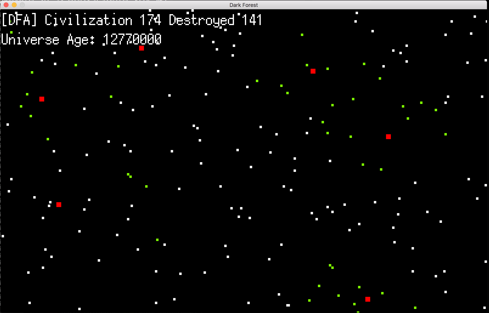

# Dark Forest

This project simulates the Dark Forest model of the Universe as described in the well-known Sci-Fi [The Three-Body-Problem](https://en.wikipedia.org/wiki/The_Three-Body_Problem)

### Background
Go READ the book.
```{go}
if TL;DR { 
	intro1 := “The universe has already been filled with civilizations and the universe \\ 
	is a dark forest. Every civilization is a hunter with guns. They are sneaking through \\ 
	the forest like ghosts, trying to carefully hide their traces and keep extremely quiet,\\
	because there are numberless other hunters who are as dangerous. If a hunter discovers \\
	another hunter, the only choice is to kill him. In the forest, others are hell and eternal\\
	threat. Anyone who reveals his exact location is bound to be doomed.”

	return Dark_Forest_Simulator
}
```

### Screenshot

* All Squares -- Civilization
* White Squares -- Hidden Civilization (those who have not revealed their coordinates)
* Red Squares -- Revealed Civilization (who broadcasted their coordinates)
* Green Squares -- Civilization that received the messages of broadcasters (Red ones)

### How to run
1. Download/Clone the project
2. `cd main`
3. `sudo chmod 777 main`
4. double click main (not main.go) OR `./main`

### How to import
1. `go get github.com/DrakeW/DarkForest`
2. in Go file, `import "github.com/DrakeW/DarkForest"`

### TODOs
1. haven't used attributes like OwnedMatter etc to determine the relative strength of different civilizations
2. drawing code are kind of mixed up in the models (probably wont fix cuz lazy)
3. didn't fully model chain of suspicion and tech explosion (which were the original ambitious goals)

### Conclusion
Go has a lot of good features, like powerful interface system, built-in concurrency mechanism via goroutines and channels (really helped model all civilizations at the same time). It's perfect for server side programming and command line tools, but it probably isn't a really suitable choice for GUI rendering (or it could just be me being not so good at writing efficent GUI rendering code in Go :) ).

